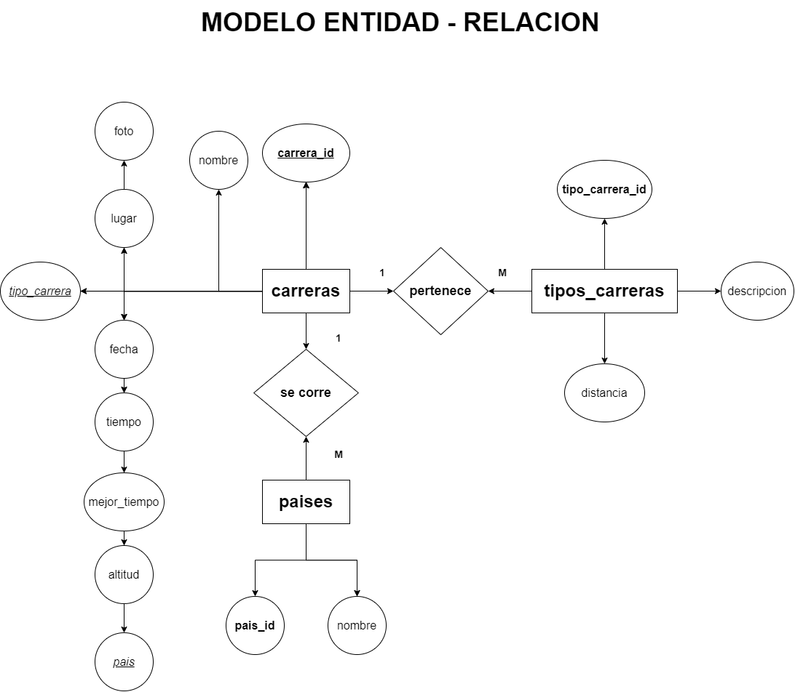
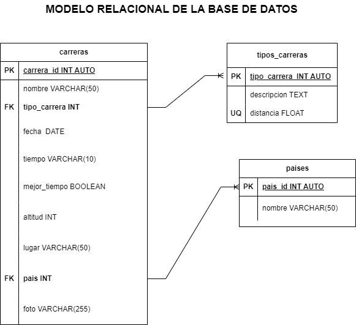

# Carreras

## Listado de Entidades

### Carreras

- carrera_id **(PK)**
- nombre
- tipo_carrera **(FK)**
- fecha
- tiempo
- mejor_tiempo
- altitud   
- lugar
- pais **(FK)**
- foto

### Tipos_Carreras

- tipo_carrera **(Pk)**
- descripcion
- distancia  **(UQ)**

### Paises

- pais_id **(PK)**
- nombre 
 
## Relaciones

1. Una **carrera** _pertenece_ a un **tipo de carrera** (_1 a M_).
1. Una **carrera** se _corre_ en un **pais** (_1 a M_).

## Diagramas

### Modelo Entidad - Relacion

### Modelo Relacional de la Base de Datos

## Reglas del Negocio

### carreras

1. Crear el registro de una carrera.
1. Leer el registro de una(s) carrera(s) dada una condicion en particular.
1. Leer todos los registros de la entidad carreras.
1. Actualizar los datos de una carrera dada una condicion particular.
1. Eliminar los datos de una carrera dada una condicion particular.

### tipos_carreras

1. Todos los valores del atributo distancia, deberan estar expresados en _km_ y no se podrán repetir.
1. Crear el registro de un tipo de carrera.
1. Leer el registro de un tipo de carrera dada una condicion en particular.
1. Leer todos los registros de la entidad tipos de carreras.
1. Actualizar los datos de un tipo de carrera dada una condicion particular.
1. Eliminar los datos de un tipo de carrera dada una condicion particular.

### paises

1. Crear el registro de un pais.
1. Leer el registro de un(os) pais(es) dada una condicion en particular.
1. Leer todos los registros de la entidad paises.
1. Actualizar los datos de un pais dada una condicion particular.
1. Eliminar los datos de un pais dada una condicion particular.

