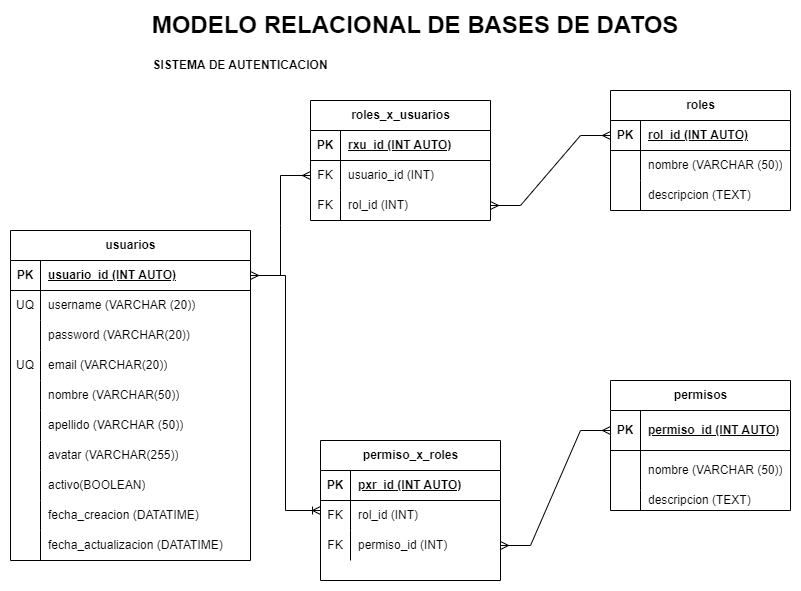

# Sistema de Autenticacion

## Listado de entidades

### usuarios **(ED)**

- usuario_id  **(PK)**
- username  **(UQ)**
- password
- email     **(UQ)**
- nombre
- apellido
- avatar
- activo
- fecha_creacion
- fecha_actualizacion

### roles **(EC)**

- rol_id  **(PK)**
- nombre
- descripcion

### permisos **(EC)**

- permiso_id **(PK)**
- nombre
- descripcion

### roles_x_usuario **(EP)**

- rxu_id **(PK)**
- usuario_id **(FK)**
- rol_id **(FK)**

### permisos_x_roles **(EP)**

- pxr_id **(PK)**
- rol_id **(FK)**
- permiso_id **(FK)**

## Relaciones

- **Usuarios** _tiene_ **Roles** (_M to M_)
- **Roles** _tiene_ **Permisos** (_M to M_) 

## Diagrama

### Modelo Relacional 

## Reglas de Negocio

### usuarios

1. Crear un nuevo usuario.
1. Leer un nuevo usuario
1. Leer todas los usuarios.
1. Actualizar un usuario.
1. Validar un usuario.
1. Habilitar un usuario.
1. Inhabilitar un usuario.
1. Actualzar datos de un usuario.
1. Actualizar password de un usuario.
1. Eliminar un usuario.

### roles

1. Crear un rol.
1. Leer un rol en particular.
1. Leer todos los roles.
1. Actualizar un rol.
1. Eliminar un rol.

### permisos

1. Crear un permiso.
1. Leer un permiso en particular.
1. Leer todos los permisos.
1. Actualizar un permiso.
1. Eliminar un permiso.

### roles_x_usuario

1. Crear un rol_x_usuario
1. Leer un rol_x_usuario en particular.
1. Leer todos los roles_x_usuario.
1. Leer todos los roles_x_usuario de un usuario.
1. Eliminar un rol_x_usuario.

### permisos_x_roles

1. Crear un permiso_x_rol
1. Leer un permiso_x_rol en particular.
1. Leer todos los permisos_x_roles.
1. Leer todos los permisos_x_roles de un rol.
1. Eliminar un permiso_x_rol.

