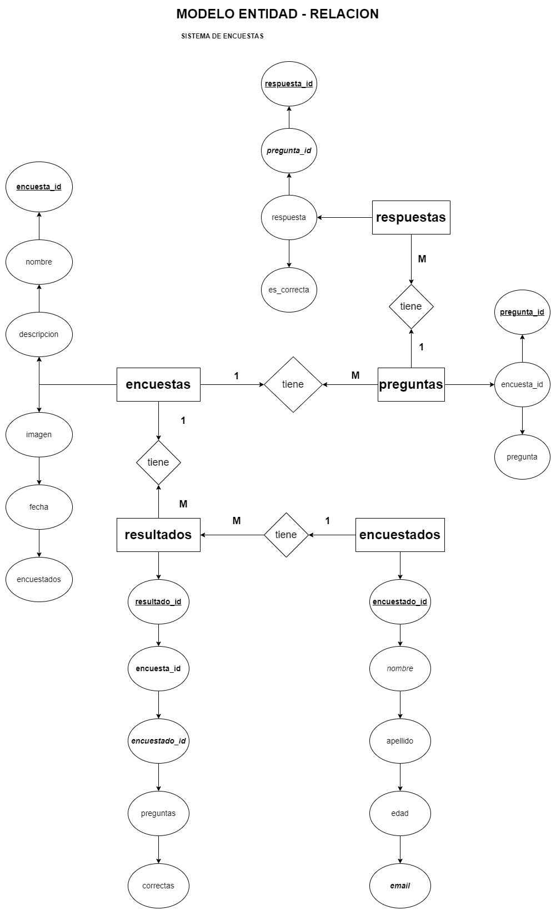
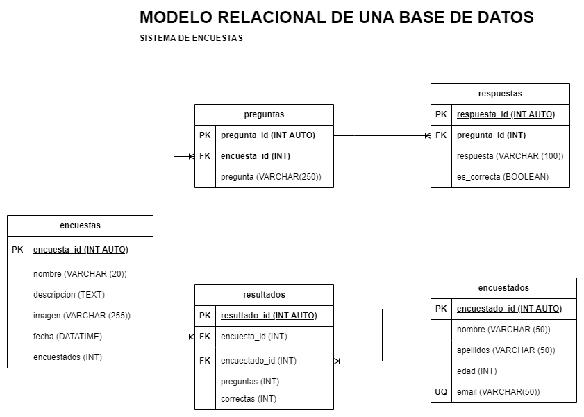

# Encuestas

## Listado de entidades

### encuestas **(ED)**
 
- encuesta_id **(PK)**
- nombre
- descripcion
- imagen
- fecha
- encuestados

### preguntas **(ED)**

- pregunta_id **(PK)**
- encuesta_id **(FK)**
- pregunta

### respuestas **(ED)**

- respuesta_id **(PK)**
- pregunta_id **(FK)**
- respuesta
- es_correcta

### encuestados **(ED)**

- encuestado_id **(PK)**
- nombre
- apellidos
- edad
- email  **(UQ)**

### resultados **(ED|EP)**

- resultado_id **(PK)**
- encuesta_id  **(FK)**
- encuestado_id **(FK)**
- preguntas
- correctas

## Relaciones

- una **encuesta** _tiene_ **preguntas**  (_1 a M_)
- una **pregunta** _tiene_ **respuestas** (_1 a M_)
- una **encuesta** _tiene_ **resultados** (_1 a M_)
- una **encuestado** _tiene_**resultados** (_1 a M_)

## Diagramas

### Modelo Entidad - Relacion

### Modelo Relacional 

## Reglas de Negocio

### encuestas

1. Crear una encuesta.
1. Leer una encuesta.
1. Leer todas las encuestas.
1. Actualizar una encuesta.
1. Eliminar una encuesta.
1. Aumentar en 1 el valor del atributo encuestados cada que un encuestado complete la encuesta.

### preguntas

1. Crear una pregunta.
1. Leer una pregunta en particular.
1. Leer todas las preguntas.
1. Actualizar una pregunta.
1. Eliminar una pregunta.

### respuestas

1. Crear una respuesta.
1. Leer una respuesta en particular.
1. Leer todas las respuestas.
1. Actualizar una respuesta.
1. Eliminar una respuesta.

### encuestados

1. Crear un encuestado.
1. Leer un encuestado en particular.
1. leer todos los encuestados.
1. Actualizar un encuestados.
1. Eliminar un encuestados.
1. Antes de crear un encuestado en la entidad, verificar mediante su email

### resultados

1. Crear un resultado.
1. Leer un resultado en particular.
1. Leer todos los resultados.
1. Actualizar un resultado.
1. Eliminar un resultado.
1. Sacar el porcentaje de asertividad que tuvo el encuestado al contestar la encuesta.

