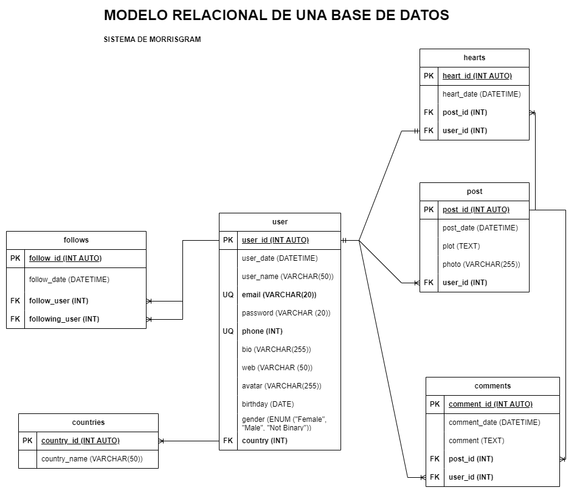

# MorrisGram

## List of Entities

### post **(ED)**

- post_id **(PK)**
- post_date
- plot
- photo
- user_id **(FK)**

### user

- user **(PK)**
- user_date
- user_name
- email **(UQ)**
- password
- phone **(UQ)**
- bio
- web
- avatar
- birthdate
- gender
- country **(FK)**

### comments **(ED | EP)**

- comment_id **(PK)**
- comment_date
- comment
- post_id **(FK)**
- user_id **(FK)**

### hearts **(ED | EP)**

- heart_id **(PK)**
- heart_date 
- post_id **(FK)**
- user_id **(FK)**

### follows

- follow_id **(PK)**
- follow_date
- follow_user **(FK)**
- following_user **(FK)**

### countries **(EC)**

- country_id **(PK)**
- country_name

## Relations

- The **users** _show_ **posts**  (_1 to M_) ✔
- The **user** _write_ **comments** (_1 to M_) ✔
- The **posts** _have_ **comments** (_1 to M_) ✔
- The **users** _give_ **hearts** (_1 to 1_)  ✔
- The **posts** _have_ **hearts** (_1 to M_) ✔
- The **users** _have_ **follows** (_1 to M_) ✔
- The **users** _keep_ **follows** (_1 to M_) ✔
- The **countries** _have_ **users** (_1 to M_) ✔

## Diagrams

### Relational Model

## Business Rules

### post

1. Create a post.
1. Read a post.
1. Read all the posts.
1. Read posts of an user.
1. Update plot of a post.
1. Delete a post.

### user

1. Create an user.
1. Read a particular user.
1. Read all users.
1. Validate a user
1. Update data user.
1. Update password user.
1. delete an user.

### comments

1. Create a comment on a post.
1. Read a particular comment on a post.
1. Read all commits on a post.
1. Count the number of comments on a post.
1. Delete a comment from a post.

### hearts

1. Create heart user on a post.
1. Count the number of hearts on a post
1. delete heart user on a post.

### follows

1. Create follow of an user.
1. Count the number of followers of an user.
1. Count the number of following of an user.
1. Delete follow of an user.

### countries

1. Create a country.
1. Read all the countries.
1. Read a country.
1. Update a country.
1. Delete a country.

