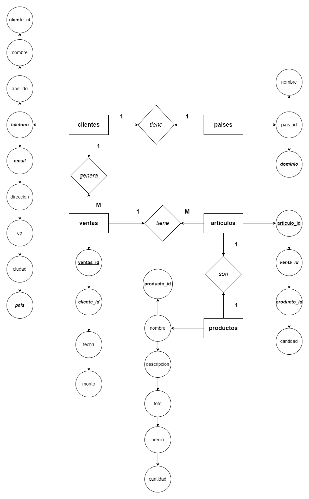
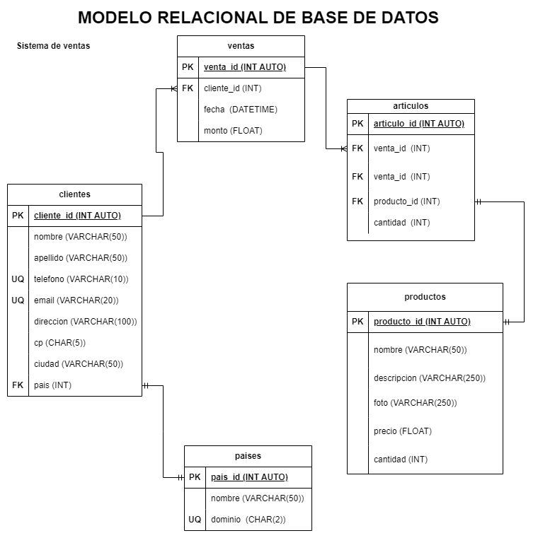

# Ventas

## Listado de Entidades

### clientes  **(ED)**

- cliente_id **(PK)**
- nombre
- apellido
- telefono **(UQ)**
- email **(UQ)**
- direccion
- cp
- ciudad
- pais **(FK)**

### productos **(ED/EC)**

- producto_id **(PK)**
- nombre
- descripcion
- foto
- precio
- cantidad

### ventas

- venta_id **(PK)**
- cliente_id **(FK)**
- fecha 
- monto

### articulos_x_venta

- articulo_id **(PK)**
- venta_id **(FK)**
- producto_id **(FK)**
- cantidad

### paises **(EC)**
- pais_id **(PK)**
- nombre
- dominio **(UQ)**

## Relaciones

1. Un **cliente** tiene **pais** (_1-1_)
1. Un **cliente** genera **ventas** (_1-M_)
1. Una **venta** tiene **articulo** (_1-M_)
1. Un **articulo** es un **producto** (_1-1_)

## Diagramas 

### Modelo Entidad - Relacion

### Modelo Relacional

## Reglas de Negocio

### clientes

1. Crear un cliente.
1. Leer un cliente.
1. Leer todos los clientes.
1. Actualizar un cliente.
1. Eliminar un cliente.

### productos

1. Crear un producto.
1. Leer un producto en particular.
1. Leer todos los productos.
1. Actualizar un producto.
1. Eliminar un producto.
1. Cada que haya una venta restar a la cantidad de productos disponibles, el numero de articulos que se vendieron.

### ventas

1. Crear una venta.
1. Leer una venta en particular.
1. Leer todas las ventas.
1. Leer todas las ventas de un cliente.
1. Leer todas las ventas de un producto.
1. Actualizar una venta.
1. Eliminar una venta.

### articulo x venta

1. Crear un articulo
1. Leer un articulo en particular.
1. leer todos los articulos.
1. Leer todos los articulos de una venta.
1. Leer todos los articulos de un producto.
1. Leer todos los articulos de un cliente.
1. Actualizar un articulo.
1. Eliminar un articulo.

### paises

1. Crear un pais.
1. Leer un pais en particular.
1. Leer todos los paises.
1. Actualizar un pais.
1. Eliminar un pais.

